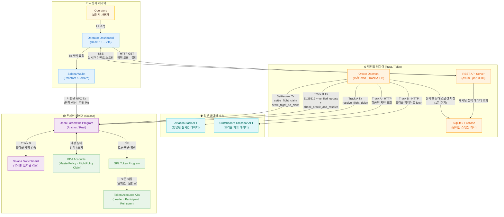

# System Architecture

```mermaid
graph TD
  %% ── 스타일 정의 ──
  classDef user fill:#FFF8E1,stroke:#FFD54F,color:#5D4037,stroke-width:2px
  classDef blue fill:#E3F2FD,stroke:#90CAF9,color:#1565C0,stroke-width:2px
  classDef orange fill:#FFF3E0,stroke:#FFB74D,color:#E65100,stroke-width:2px
  classDef purple fill:#F3E5F5,stroke:#CE93D8,color:#6A1B9A,stroke-width:2px
  classDef green fill:#E8F5E9,stroke:#A5D6A7,color:#2E7D32,stroke-width:2px
  classDef extapi fill:#E0F7FA,stroke:#80DEEA,color:#00695C,stroke-width:2px

  %% ══════════════════════════════════════
  %%  사용자 레이어
  %% ══════════════════════════════════════
  subgraph USER_LAYER["👤 사용자 레이어"]
    direction LR
    U["Operators\n보험사 사용자"]:::user
    D["Operator Dashboard\n(React 19 + Vite)"]:::blue
    W["Solana Wallet\n(Phantom / Solflare)"]:::blue
  end

  U -->|"UI 조작"| D
  D -->|"Tx 서명 요청"| W

  %% ══════════════════════════════════════
  %%  백엔드 레이어
  %% ══════════════════════════════════════
  subgraph BACKEND_LAYER["⚙️ 백엔드 레이어 (Rust / Tokio)"]
    direction TB
    API["REST API Server\n(Axum · port 3000)"]:::orange
    OD["Oracle Daemon\n(15분 cron · Track A + B)"]:::orange
    DB["SQLite / Firebase\n(온체인 스냅샷 캐시)"]:::orange
  end

  D -->|"HTTP GET\n정책 조회 · 필터"| API
  API -->|"SSE\n실시간 이벤트 스트림"| D
  API -->|"캐시된 정책 데이터 조회"| DB
  OD -->|"온체인 상태 스냅샷 저장\n(1분 주기)"| DB

  %% ══════════════════════════════════════
  %%  외부 API
  %% ══════════════════════════════════════
  subgraph EXT_API["🌐 외부 데이터 소스"]
    direction LR
    AV["AviationStack API\n(항공편 실시간 데이터)"]:::extapi
    SC["Switchboard Crossbar API\n(오라클 피드 데이터)"]:::extapi
  end

  OD -->|"Track A · HTTP\n항공편 지연 조회"| AV
  OD -->|"Track B · HTTP\n오라클 업데이트 fetch"| SC

  %% ══════════════════════════════════════
  %%  온체인 레이어
  %% ══════════════════════════════════════
  subgraph ONCHAIN_LAYER["🟣 온체인 레이어 (Solana)"]
    direction TB
    P["Open Parametric Program\n(Anchor / Rust)"]:::purple
    SB["Solana Switchboard\n(온체인 오라클 검증)"]:::purple
    PDA["PDA Accounts\n(MasterPolicy · FlightPolicy · Claim)"]:::green
    SPL["SPL Token Program"]:::green
    ATA["Token Accounts ATA\n(Leader · Participant · Reinsurer)"]:::green
  end

  W -->|"서명된 RPC Tx\n(정책 생성 · 컨펌 등)"| P
  OD -->|"Track A Tx\nresolve_flight_delay"| P
  OD -->|"Track B Tx\nEd25519 + verified_update\n+ check_oracle_and_resolve"| P
  OD -->|"Settlement Tx\nsettle_flight_claim\nsettle_flight_no_claim"| P

  P <-->|"계정 상태\n읽기 / 쓰기"| PDA
  P -->|"CPI\n토큰 전송 명령"| SPL
  SPL -->|"토큰 이동\n(보험료 · 보험금)"| ATA
  P <-->|"Track B\n오라클 서명 검증"| SB
```
